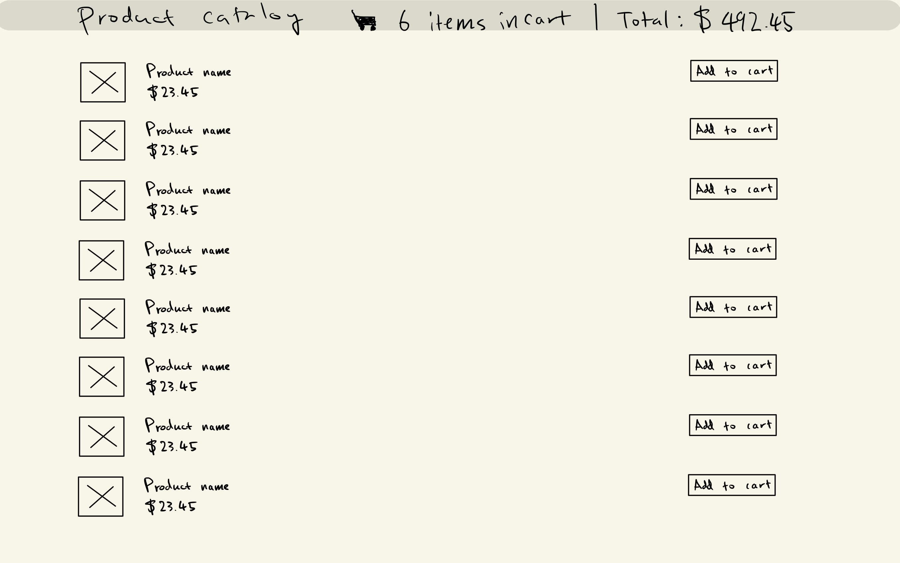

# Odeko Checkout interview project

## Project description

Implement an online checkout flow. We started the frontend app here in this
repo. You can find instructions on how to use it in [the original readme][cra]
generated by create-react-app; you'll need Node.js and Yarn.

We ask that you spend about 3 hours on this project. We don't expect you to
finish; we just hope to get to know you a bit better with this exercise. But if you
do decide to use more time, let us know what you worked on before and after
those 3 hours.

We implemented the backend server for you. You should have received a link to
your account where you can create an API key. Keep them secure!

You can choose between using the HTTP or GraphQL endpoints. They're functionally
identical.

- [Interactive HTTP docs](https://secret-shore-94903.herokuapp.com/api-docs)
- [Interactive GraphQL docs](https://secret-shore-94903.herokuapp.com/graphiql)

We've included some instructions on how to authenticate (and instructions for
using TypeScript) [below](#tips).

## Instructions

- Consider this project one where you're the primary contributor. Feel free to
  improve the codebase however you'd like; refactor, fix, replace, and redo as
  you wish. But we do ask that you keep it a React app.
- We will be reviewing your solution commit-by-commit so that we can understand
  your thought process. So instead of putting everything in a single giant
  commit, make frequent cohesive commits so we can see what your work
  progression looks like.
- When submitting your project, please indicate which tasks you worked on.
- Leave comments in places where you weren't quite sure if you were solving the
  problem correctly to let us know that you've thought about it and made a
  conscious decision.
- Provide working instructions for how to run your application, and make sure
  that the application will run on someone else's machine.
- Fulfill the [challenges](#challenges) below. Don't hesitate to ask us
  questions. Let us know when you're done and open a PR for review. Good luck!

## Mockups

| Page                                  | Description             |
|---------------------------------------|-------------------------|
|    | Product catalog page    |
|       | Cart page               |

## Challenges

Feel free to work on whichever you prefer—maybe something you're good at, or
something that looks challenging.

### Recommended: Get the cart and navbar working

A few things to keep in mind:

* We have an API for adding items to the cart
* For the quantity drop down, the possible quantities should be 1–10
* The navbar should display the number of unique products in the cart
* The navbar should display the total price of everything in the cart
* The navbar should be updated whenever something changes to the cart

### Extra credit: Load all products from the paginated endpoint

The list of products is paginated. Load all the products and display them all on
one page. (Don't add pagination links to the catalog)

You have two options:

* Load all the products immediately on page load and display the entire list OR
* Set up "infinite scroll"

### Extra credit: Style the site

You might take this in a couple of directions:

* Make the site responsive so that it can work with large screens, tablets,
  and/or mobile devices.
* Polish the site. The wireframes are pretty bare, and there's lots of room for
  improvement.

### Extra credit: Vendor rules (Hard)

We have Vendor A that sells all products that start with the letter A, Vendor B
that sells products that start with B, etc. Add the following validations and
constraints:

1. All items have a maximum quantity of 10 unless specified.
    * Exceptions: Vendors A, E, I, O, and U have a maximum quantity per item of 25.
2. Vendors A-M have a minimum order requirement of $500
3. Vendors N-Z have a minimum order requirement of $1000
4. Vendors A, E, I, O, and U like to sell their items in batches of 5. Ensure
   the dropdown only shows 0, 5, 10, etc, while keeping in mind that the price
   from the server is the price for each item, not for each batch
5. Show an error message in the checkout page if the order is too small. This
   can be itemized or global one
6. If it is impossible to order from a vendor because `∑(Item cost × maximum item quantity)`
   is less than the vendor's order minimum, hide all the items from that vendor
   in the catalog.

### Extra credit: Implement client-side search of product names (Hard)

Add a search input on the catalog page only. Optionally:

* Optionally, make it work with the paginated list of products
* Optionally, add radio buttons for
    * "All items", "In cart", and "Not in cart"
* Optionally, add a drop down to sort by
    * "Default", "Alphabetical", "Expensive first", "Cheaper first"

## Tips

- To authenticate with the API, you must set the `Authorization` header
    - `Authorization: Token $YOUR_TOKEN`
- To authenticate with Swagger (HTTP docs), press the `Authorize` button
    - Enter `$YOUR_TOKEN`
- To authenticate with GraphiQL (GraphQL docs), press the `REQUEST HEADERS`
  button at the bottom of the page
    - Enter `{ "Authorization": "Token $YOUR_TOKEN" }`
- This project was set up to use TypeScript, but we turned it off in most cases.
  If you'd like to use it, rename `App.jsx` to `App.tsx`.
- Instead of modifying this `README.md`, create a new file `README.markdown`.
  GitHub will display that one by default since it comes first in alphabetical
  order.
- This repo was created with [create-react-app][cra]

[cra]: ./CREATE_REACT_APP.md
